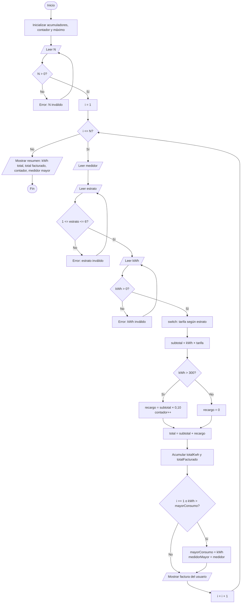

<div align="center">

# ⚡ EcoEnergy – Consumo Eléctrico

### Examen Práctico · Programación en Java · Estructuras de Control

**Universidad Técnica de Ambato – FISEI · Ingeniería de Software**


</div>

---

## 👥 Integrantes – Grupo 6

| # | Integrante |
|:-:|---|
| 1 | Leyber Peñafiel |
| 2 | Matias Pico |
| 3 | Joel Pacha |
| 4 | Marlon Yaguana |
| 5 | Joseph Castro |
| 6 | Steeve Ortiz |

| Campo | Información |
|---|---|
| **Paralelo** |Primero - B|
| **Docente** | Ing. José Caiza .Mg |
| **Asignatura** | Programación en Java – Estructuras de Control |

---

## 📑 Tabla de contenido

1. [Enunciado](#-1-enunciado)
2. [Análisis del problema](#-2-análisis-del-problema)
3. [Entradas – Procesos – Salidas](#-3-entradas--procesos--salidas)
4. [Variables](#-4-variables)
5. [Algoritmo / Pseudocódigo](#-5-algoritmo--pseudocódigo)
6. [Diagrama de flujo](#-6-diagrama-de-flujo)
7. [Código fuente](#-7-código-fuente)
8. [Estructuras de control utilizadas](#-8-estructuras-de-control-utilizadas)
9. [Casos de prueba](#-9-casos-de-prueba)
10. [Prueba de escritorio](#-10-prueba-de-escritorio)
11. [Evidencias](#-11-evidencias)
12. [Cómo compilar y ejecutar](#-12-cómo-compilar-y-ejecutar)
13. [Estructura del repositorio](#-13-estructura-del-repositorio)
14. [Registro de commits](#-14-registro-de-commits)

---

## 📌 1. Enunciado

> **GRUPO 6 – EcoEnergy: Consumo eléctrico**
>
> Solicitar medidor, estrato (1–6) y kWh. Validar entradas; usar switch/if para calcular una tarifa según estrato; procesar N usuarios; mostrar kWh total, total facturado y medidor con mayor consumo.

---

## 🔍 2. Análisis del problema

Una empresa eléctrica necesita facturar el consumo de **N usuarios**. Para cada usuario se registra su número de medidor, su estrato socioeconómico (1 a 6) y su consumo en kWh. El precio del kWh depende del estrato y, si el usuario consume **más de 300 kWh**, se aplica un **recargo del 10 %** sobre el subtotal.

Al terminar de procesar a todos los usuarios, el programa muestra un **resumen general** con el consumo total, el dinero facturado, la cantidad de usuarios con recargo y el medidor con mayor consumo.

### 💲 Tabla de tarifas (USD por kWh)

| Estrato | 1 | 2 | 3 | 4 | 5 | 6 |
|:-:|:-:|:-:|:-:|:-:|:-:|:-:|
| **Precio kWh** | $0,05 | $0,07 | $0,09 | $0,11 | $0,13 | $0,15 |

### 📐 Fórmulas

```
subtotal = kWh × tarifa
recargo  = subtotal × 0,10    (solo si kWh > 300; si no, recargo = 0)
total    = subtotal + recargo
```

### ✅ Reglas de validación

| Dato | Regla | Si es inválido |
|---|---|---|
| N | N > 0 | Muestra error y vuelve a pedir |
| Estrato | 1 ≤ estrato ≤ 6 | Muestra error y vuelve a pedir |
| kWh | kWh > 0 | Muestra error y vuelve a pedir |

> ℹ️ **Nota:** el enunciado no indica valores de tarifa. Los valores de la tabla y el recargo del 10 % fueron definidas por nosotros.

---

## 🔄 3. Entradas – Procesos – Salidas

| 📥 Entradas | ⚙️ Procesos | 📤 Salidas |
|---|---|---|
| N (cantidad de usuarios) | Validar N > 0 | Factura de cada usuario (tarifa, subtotal, recargo, total) |
| Número de medidor | Validar estrato entre 1 y 6 | kWh total consumido |
| Estrato (1–6) | Validar kWh > 0 | Total facturado |
| Consumo en kWh | Asignar tarifa con `switch` según estrato | Cantidad de usuarios con recargo |
| | Calcular subtotal = kWh × tarifa | Medidor con mayor consumo |
| | Aplicar recargo con `if` (kWh > 300) | |
| | Acumular kWh y total facturado | |
| | Contar usuarios con recargo | |
| | Determinar el mayor consumo (máximo) | |

---

## 🧮 4. Variables

| Variable | Tipo | Función |
|---|:-:|---|
| `n` | `int` | Cantidad de usuarios |
| `medidor` | `String` | Número de medidor |
| `estrato` | `int` | Estrato del usuario |
| `kwh` | `double` | Consumo del usuario |
| `tarifa`, `subtotal`, `recargo`, `total` | `double` | Cálculos de la factura |
| `totalKwh` | `double` | 🔢 **Acumulador** de kWh |
| `totalFacturado` | `double` | 💰 **Acumulador** de dinero facturado |
| `contadorAltoConsumo` | `int` | ➕ **Contador** de usuarios con más de 300 kWh |
| `mayorConsumo`, `medidorMayor` | `double`, `String` | 🏆 **Máximo**: mayor consumo y su medidor |

---

## 📝 5. Algoritmo / Pseudocódigo

```
INICIO
  totalKwh = 0
  totalFacturado = 0
  contadorAltoConsumo = 0
  mayorConsumo = 0
  medidorMayor = ""

  HACER
     leer n
     SI n <= 0 ENTONCES mostrar "Error: N debe ser mayor que 0."
  MIENTRAS n <= 0

  PARA i = 1 HASTA n
     leer medidor

     HACER
        leer estrato
        SI estrato < 1 O estrato > 6 ENTONCES mostrar "Error"
     MIENTRAS estrato < 1 O estrato > 6

     HACER
        leer kwh
        SI kwh <= 0 ENTONCES mostrar "Error"
     MIENTRAS kwh <= 0

     SEGUN estrato HACER
        1: tarifa = 0.05
        2: tarifa = 0.07
        3: tarifa = 0.09
        4: tarifa = 0.11
        5: tarifa = 0.13
        6: tarifa = 0.15
     FIN SEGUN

     subtotal = kwh * tarifa

     SI kwh > 300 ENTONCES
        recargo = subtotal * 0.10
        contadorAltoConsumo = contadorAltoConsumo + 1
     SINO
        recargo = 0
     FIN SI

     total = subtotal + recargo
     totalKwh = totalKwh + kwh
     totalFacturado = totalFacturado + total

     SI i == 1 O kwh > mayorConsumo ENTONCES
        mayorConsumo = kwh
        medidorMayor = medidor
     FIN SI

     mostrar tarifa, subtotal, recargo, total
  FIN PARA

  mostrar totalKwh, totalFacturado, contadorAltoConsumo, medidorMayor, mayorConsumo
  mostrar "Programa finalizado correctamente."
FIN
```

---

## 📊 6. Diagrama de flujo



---

## 💻 7. Código fuente

📄 `Ejercicio1/Ejercicio1.java`

```java
import java.util.Scanner;

public class Ejercicio1 {
    public static void main(String[] args) {
        Scanner sc = new Scanner(System.in);

        int n;                       // cantidad de usuarios
        String medidor;
        int estrato;
        double kwh, tarifa, subtotal, recargo, total;

        // Acumuladores
        double totalKwh = 0;
        double totalFacturado = 0;

        // Contador
        int contadorAltoConsumo = 0;

        // Máximo
        double mayorConsumo = 0;
        String medidorMayor = "";

        System.out.println("===== ECOENERGY - CONSUMO ELECTRICO =====");

        // Validar N
        do {
            System.out.print("Ingrese la cantidad de usuarios (N > 0): ");
            n = sc.nextInt();
            if (n <= 0) {
                System.out.println("Error: N debe ser mayor que 0.");
            }
        } while (n <= 0);

        // Ciclo principal
        for (int i = 1; i <= n; i++) {
            System.out.println("\n--- Usuario " + i + " ---");

            System.out.print("Numero de medidor: ");
            medidor = sc.next();

            // Validar estrato
            do {
                System.out.print("Estrato (1-6): ");
                estrato = sc.nextInt();
                if (estrato < 1 || estrato > 6) {
                    System.out.println("Error: el estrato debe estar entre 1 y 6.");
                }
            } while (estrato < 1 || estrato > 6);

            // Validar kWh
            do {
                System.out.print("Consumo en kWh (> 0): ");
                kwh = sc.nextDouble();
                if (kwh <= 0) {
                    System.out.println("Error: el consumo debe ser mayor que 0.");
                }
            } while (kwh <= 0);

            // Tarifa según estrato
            switch (estrato) {
                case 1: tarifa = 0.05; break;
                case 2: tarifa = 0.07; break;
                case 3: tarifa = 0.09; break;
                case 4: tarifa = 0.11; break;
                case 5: tarifa = 0.13; break;
                default: tarifa = 0.15; break;   // estrato 6
            }

            subtotal = kwh * tarifa;

            // Recargo por alto consumo
            if (kwh > 300) {
                recargo = subtotal * 0.10;
                contadorAltoConsumo++;
            } else {
                recargo = 0;
            }

            total = subtotal + recargo;

            // Acumular
            totalKwh += kwh;
            totalFacturado += total;

            // Mayor consumo
            if (i == 1 || kwh > mayorConsumo) {
                mayorConsumo = kwh;
                medidorMayor = medidor;
            }

            System.out.printf("Tarifa: $%.2f/kWh | Subtotal: $%.2f | Recargo: $%.2f | Total: $%.2f%n",
                    tarifa, subtotal, recargo, total);
        }

        // Resultados
        System.out.println("\n========== RESUMEN ==========");
        System.out.println("Usuarios procesados: " + n);
        System.out.printf("kWh total consumido: %.2f kWh%n", totalKwh);
        System.out.printf("Total facturado: $%.2f%n", totalFacturado);
        System.out.println("Usuarios con recargo (>300 kWh): " + contadorAltoConsumo);
        System.out.printf("Medidor con mayor consumo: %s (%.2f kWh)%n", medidorMayor, mayorConsumo);
        System.out.println("Programa finalizado correctamente.");

        sc.close();
    }
}
```

---

## 🧩 8. Estructuras de control utilizadas

| Requisito de la guía | ✔️ | Dónde se cumple |
|---|:-:|---|
| Lectura con Scanner | ✅ | `sc.nextInt()`, `sc.next()`, `sc.nextDouble()` |
| Estructura de selección | ✅ | `switch` (tarifa por estrato) e `if/else` (recargo) |
| Estructura de repetición | ✅ | `for` (procesar N usuarios) y `do-while` (validaciones) |
| Validación de datos | ✅ | N > 0, estrato entre 1 y 6, kWh > 0 |
| Contador | ✅ | `contadorAltoConsumo` |
| Acumulador | ✅ | `totalKwh`, `totalFacturado` |
| Máximo | ✅ | `mayorConsumo` / `medidorMayor` |
| Mensajes claros y finalización | ✅ | Resumen final y "Programa finalizado correctamente." |

---

## 🧪 9. Casos de prueba

### 🟢 Caso 1 – Normal (N = 3)

| Medidor | Estrato | kWh | Tarifa | Subtotal | Recargo | Total |
|:-:|:-:|:-:|:-:|:-:|:-:|:-:|
| M001 | 2 | 150 | 0,07 | 150 × 0,07 = 10,50 | 0,00 | **10,50** |
| M002 | 4 | 350 | 0,11 | 350 × 0,11 = 38,50 | 38,50 × 0,10 = 3,85 | **42,35** |
| M003 | 1 | 80 | 0,05 | 80 × 0,05 = 4,00 | 0,00 | **4,00** |

**Resultado esperado:**
- kWh total = 150 + 350 + 80 = **580 kWh**
- Total facturado = 10,50 + 42,35 + 4,00 = **$56,85**
- Usuarios con recargo = **1**
- Medidor con mayor consumo = **M002 (350 kWh)**

### 🟡 Caso 2 – Límite (N = 1)

| Medidor | Estrato | kWh | Tarifa | Subtotal | Recargo | Total |
|:-:|:-:|:-:|:-:|:-:|:-:|:-:|
| M010 | 6 | 300 | 0,15 | 300 × 0,15 = 45,00 | 0,00 *(300 no es > 300)* | **45,00** |

**Resultado esperado:** kWh total = **300** · Total facturado = **$45,00** · Usuarios con recargo = **0** · Mayor consumo = **M010**

### 🔴 Caso 3 – Datos inválidos

| Entrada | Mensaje esperado | Acción |
|:-:|---|---|
| N = 0 | `Error: N debe ser mayor que 0.` | Vuelve a pedir N |
| Estrato = 7 | `Error: el estrato debe estar entre 1 y 6.` | Vuelve a pedir el estrato |
| kWh = -20 | `Error: el consumo debe ser mayor que 0.` | Vuelve a pedir los kWh |

---

## 🗂️ 10. Prueba de escritorio

Seguimiento de variables con los datos del **Caso 1** (N = 3):

| i | medidor | estrato | kwh | tarifa | subtotal | recargo | total | totalKwh | totalFacturado | contador | mayorConsumo | medidorMayor |
|:-:|:-:|:-:|:-:|:-:|:-:|:-:|:-:|:-:|:-:|:-:|:-:|:-:|
| inicio | – | – | – | – | – | – | – | 0 | 0,00 | 0 | 0 | "" |
| 1 | M001 | 2 | 150 | 0,07 | 10,50 | 0,00 | 10,50 | 150 | 10,50 | 0 | 150 | M001 |
| 2 | M002 | 4 | 350 | 0,11 | 38,50 | 3,85 | 42,35 | 500 | 52,85 | 1 | 350 | M002 |
| 3 | M003 | 1 | 80 | 0,05 | 4,00 | 0,00 | 4,00 | 580 | 56,85 | 1 | 350 | M002 |
| fin | – | – | – | – | – | – | – | **580** | **56,85** | **1** | **350** | **M002** |

**Salida esperada en consola:**

```
========== RESUMEN ==========
Usuarios procesados: 3
kWh total consumido: 580.00 kWh
Total facturado: $56.85
Usuarios con recargo (>300 kWh): 1
Medidor con mayor consumo: M002 (350.00 kWh)
Programa finalizado correctamente.
```

> El separador decimal (punto o coma) que muestra `printf` depende de la configuración regional del equipo.

---

## 📎 11. Evidencias

### 🖼️ Capturas de compilación y ejecución

**Compilación**


**Caso normal**


**Caso límite**


**Caso inválido**


---

## ▶️ 12. Cómo compilar y ejecutar

**Requisitos:** JDK 8 o superior · Visual Studio Code con *Extension Pack for Java* (o una terminal).

```bash
cd Ejercicio1
javac Ejercicio1.java
java Ejercicio1
```

En Visual Studio Code también se puede abrir `Ejercicio1.java` y presionar **Run** sobre el método `main`.

---

## 📁 13. Estructura del repositorio

```
prueba-practica-logica-Nombre-Apellido/
├── README.md
├── Ejercicio1/
│   ├── Ejercicio1.java
│   ├── evidencia/
│   │   └── Ejercicio1_evidencia_manuscrita.pdf
│   └── capturas/
│       ├── 01_compilacion.png
│       ├── 02_caso_normal.png
│       ├── 03_caso_limite.png
│       └── 04_caso_invalido.png
└── Ejercicio2/
    ├── Ejercicio2.java
    ├── evidencia/
    │   └── Ejercicio2_evidencia_manuscrita.pdf
    └── capturas/
        ├── 01_compilacion.png
        ├── 02_caso_normal.png
        ├── 03_caso_limite.png
        └── 04_caso_invalido.png
```

---

